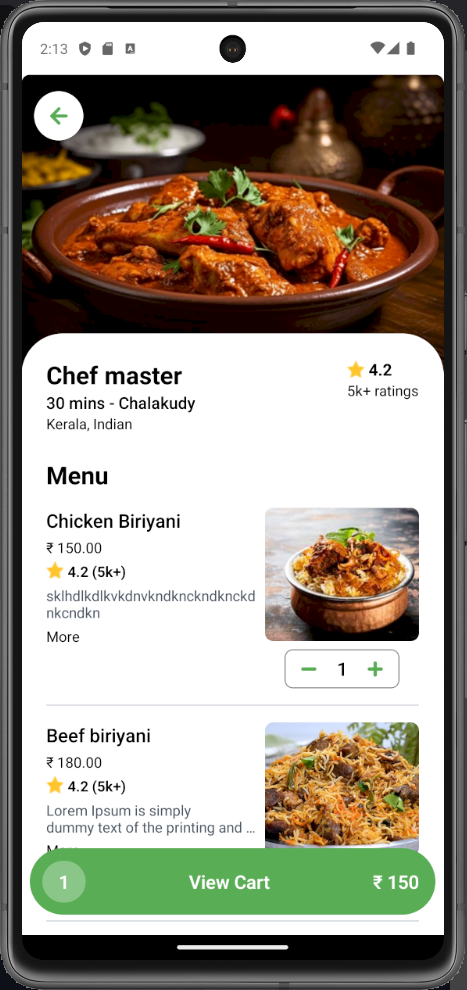

# HungryHub - A food delivery application build using React Native, Python Django and PostgreSQL.

Additional features:

- [React Navigation](https://reactnavigation.org/docs/getting-started) Routing and navigation for Expo and React Native apps
- [Expo](https://docs.expo.dev/get-started/introduction/) Expo is a framework that makes developing Android and iOS apps easier.
- [Stripe](https://docs.stripe.com/get-started) for payment integration
- [Redux Toolkit](https://redux-toolkit.js.org/) for state management

## App Screenshots

## Demo

<!--  -->
<!-- 

 -->

